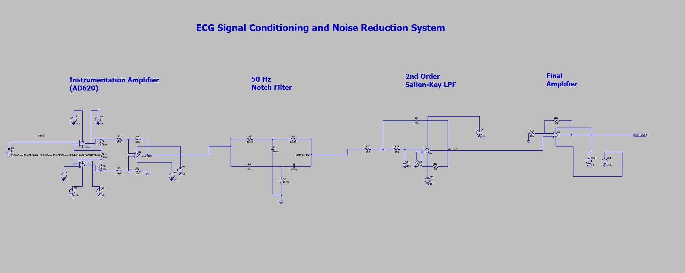
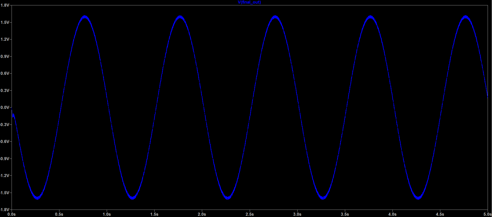

# ECG Signal Conditioning and Noise Reduction System

## Overview

This project implements an ECG signal conditioning chain in LTspice to amplify low-amplitude ECG-like signals and suppress unwanted noise components. The system combines amplification and filtering stages to improve signal quality for analysis and observation.

## Components

* Instrumentation Amplifier (Gain ≈ 101)
* 50 Hz Twin-T Notch Filter
* 2nd Order Sallen-Key Low-Pass Filter (Cutoff Frequency ≈ 100 Hz)
* Non-Inverting Final Gain Stage (Gain = 10)

## Objectives

* Amplify millivolt-level ECG-like signals
* Remove 50 Hz power-line interference
* Reduce 300 Hz high-frequency noise
* Analyze circuit performance through transient and frequency-domain simulations
* Validate theoretical calculations using LTspice simulation results

## Input Signal

The simulated input signal consists of:

* 1 Hz ECG-like component (1 mV)
* 50 Hz power-line interference (0.5 mV)
* 300 Hz high-frequency noise (0.3 mV)

## Design Methodology

### Instrumentation Amplifier

A three-op-amp instrumentation amplifier is used to amplify the weak ECG-like signal while maintaining high input impedance and good common-mode noise rejection.

### Twin-T Notch Filter

The notch filter is designed for a center frequency of 50 Hz to suppress power-line interference commonly present in biomedical signal acquisition systems.

### Sallen-Key Low-Pass Filter

A second-order Sallen-Key low-pass filter with a cutoff frequency of approximately 100 Hz is used to attenuate high-frequency noise while preserving the desired signal component.

### Final Gain Stage

A non-inverting amplifier provides additional gain to obtain a clearly observable output signal suitable for further analysis.

## Tools Used

* LTspice

## Results

* Instrumentation amplifier gain of approximately 101 verified through simulation.
* Successful attenuation of 50 Hz power-line interference using a Twin-T notch filter.
* Significant reduction of 300 Hz high-frequency noise using a second-order Sallen-Key low-pass filter.
* Final output amplitude increased from the millivolt range to approximately ±1.6 V.
* Theoretical calculations showed close agreement with LTspice simulation results.
* Replacing the first-order low-pass filter with a second-order Sallen-Key filter improved high-frequency noise suppression.

## Circuit Schematic

## Output Waveform

